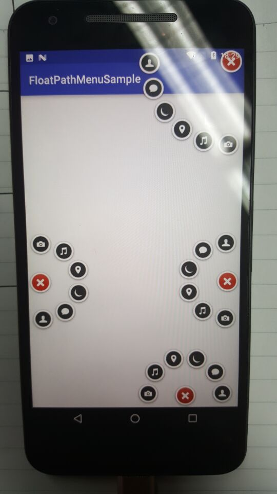
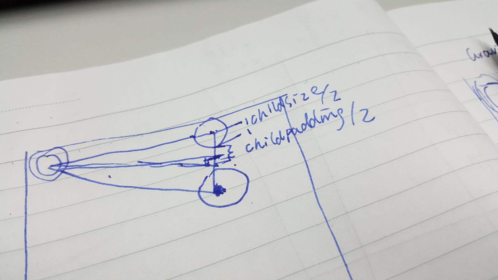
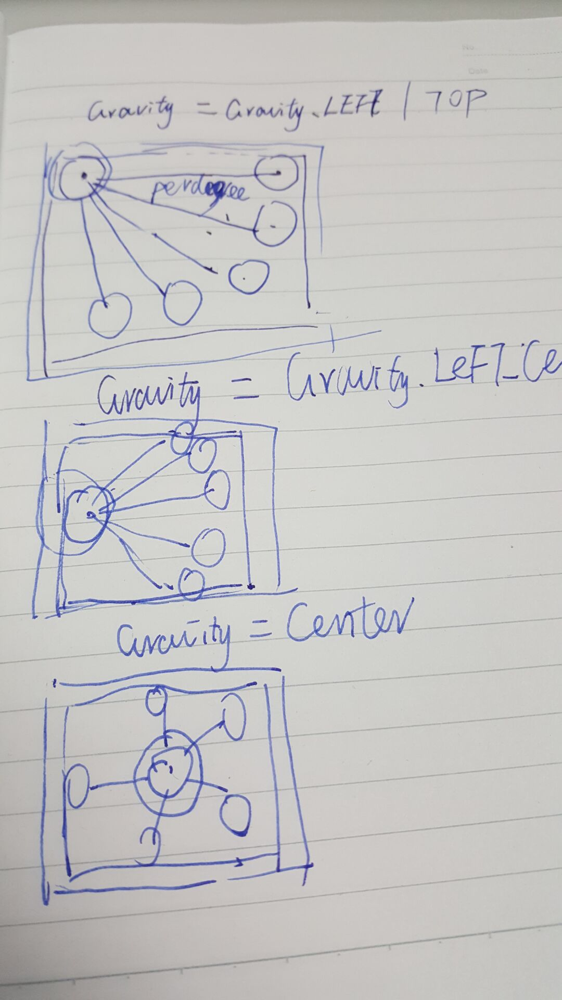

# FloatPathMenuSample
modified from  daCapricorn/ArcMenu[ https://github.com/daCapricorn/ArcMenu](https://github.com/daCapricorn/ArcMenu)

demo:

半径计算公式 ：
半径==( 间距+子菜单大小) /2 x sin(夹角/2)

原理图：

原作者代码有一处bug，悬浮球居中时，子菜单数有两个重叠，原因是计算子菜单夹角时没考虑360度的情况，核心代码：
 
	  final float perDegrees = Math.abs(mToDegrees - mFromDegrees) == 360 ? 
	(mToDegrees - mFromDegrees) / (childCount) 
	: (mToDegrees - mFromDegrees) / (childCount - 1);
     

需求来自 [linh47](https://github.com/linh47/PathMenu)的提问，在 [https://github.com/linh47/PathMenu](https://github.com/linh47/PathMenu)基础上增加悬浮可拖动功能，对应区域自动切换扇形区域，目前还有点小问题

 - modified form  [daCapricorn`s ArcMenu](https://github.com/daCapricorn/ArcMenu)
 - [https://github.com/crosg/FloatMenuSample](https://github.com/crosg/FloatMenuSample)

 - Contributors:
	[yiming](https://github.com/fanOfDemo)  , [linh47](https://github.com/linh47/PathMenu)